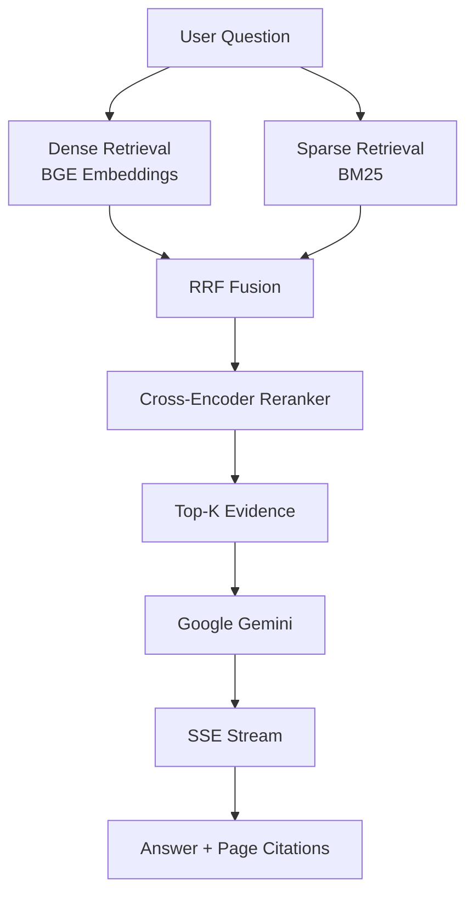
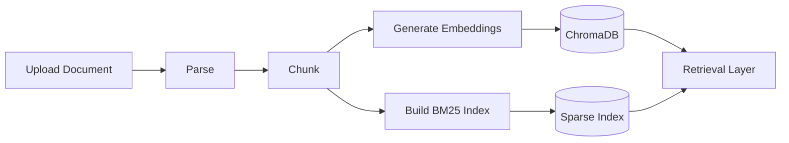

# 🎓 ScholarRAG

### Local-First Academic Retrieval-Augmented Generation for Evidence-Grounded Document Research

**ScholarRAG** is a local-first hybrid Retrieval-Augmented Generation (RAG) platform for researching academic papers, technical documentation, presentations, and professional reports.

It combines **dense semantic retrieval**, **BM25 lexical search**, **Reciprocal Rank Fusion (RRF)**, **cross-encoder reranking**, and **Google Gemini generation** to produce context-aware answers grounded in the uploaded documents.

The key goal is simple:

> **Ask questions about your documents and get answers that can be traced back to the relevant page and chunk.**

---

## ✨ Why ScholarRAG?

Traditional document chat systems can miss exact terminology, retrieve loosely related passages, or generate answers without making the evidence easy to verify.

ScholarRAG addresses this with a multi-stage retrieval pipeline:

**Dense Search + BM25 → RRF Fusion → Cross-Encoder Reranking → Evidence Selection → Gemini Generation → Page-Level Citations**

This design keeps retrieval broad enough to capture relevant evidence while using reranking to narrow the final context before generation.

---

## 🚀 Highlights

| Capability | What it does |
| --- | --- |
| 🧠 **Hybrid Retrieval** | Combines semantic vector search with BM25 lexical retrieval. |
| 🔀 **RRF Fusion** | Merges dense and sparse rankings into a unified candidate set. |
| 🎯 **Cross-Encoder Reranking** | Re-scores candidate chunks for query-specific relevance. |
| 🤖 **Gemini Generation** | Generates answers from the selected document evidence. |
| 📑 **Page-Level Citations** | Preserves document, page, and chunk metadata for traceability. |
| ⚡ **SSE Streaming** | Streams generated responses to the frontend in real time. |
| 🔒 **Local-First Processing** | Parsing, embedding, indexing, and reranking can run locally. |
| 🎨 **Modern React UI** | Responsive interface with TailwindCSS, Radix-style components, icons, animations, and state management. |

---

## 🏗️ Architecture

### Query / QA Pipeline



### Document Ingestion Pipeline



Each indexed chunk keeps metadata such as:

- Document name
- Page number
- Chunk ID
- Source text

This metadata travels through retrieval and generation so the final response can point back to the originating evidence.

---

## 🔍 How Retrieval Works

### 1. Dense Retrieval

The query is embedded with:

`BAAI/bge-small-en-v1.5`

The resulting vector is searched against the ChromaDB collection to retrieve semantically related chunks.

### 2. Sparse Retrieval

The same query is searched using **BM25Okapi**.

This is especially useful for exact terms, names, abbreviations, identifiers, and technical vocabulary that may not be captured as strongly by semantic similarity alone.

### 3. Reciprocal Rank Fusion

Dense and sparse results are combined using **RRF**, producing a single candidate ranking from both retrieval signals.

Conceptually:

```
RRF(d) = Σ 1 / (k + rank(d))
```

where each retrieval system contributes according to the position of a document/chunk in its ranked list.

### 4. Cross-Encoder Reranking

The fused candidates are passed to:

`BAAI/bge-reranker-base`

Unlike embedding similarity, a cross-encoder jointly evaluates the query and candidate text, allowing more fine-grained relevance scoring.

### 5. Evidence Selection

Only the strongest candidates are forwarded as context to the generation stage.

### 6. Grounded Generation

Google Gemini generates the final response using the retrieved evidence rather than relying only on the model's general knowledge.

### 7. Citation Delivery

The frontend receives the answer together with source metadata so users can inspect the relevant document page/chunk.

---

## 📚 Supported Documents

Currently supported:

- **PDF** — `.pdf`
- **PowerPoint** — `.pptx`
- **Plain Text** — `.txt`

The backend dependencies also include tooling relevant to PDF/OCR workflows, creating a foundation for future scanned-document support.

Planned document support includes:

- DOCX
- Markdown
- Scanned PDFs / OCR
- Tables
- Figures and images

---

## 🛠️ Technology Stack

### Backend

| Layer | Technology |
| --- | --- |
| API | FastAPI + Uvicorn |
| Language | Python |
| Database | SQLite + SQLAlchemy/async SQLite |
| Vector Store | ChromaDB |
| Dense Embeddings | `BAAI/bge-small-en-v1.5` |
| Sparse Retrieval | `rank-bm25` / BM25Okapi |
| Reranker | `BAAI/bge-reranker-base` |
| LLM | Google Gemini |
| PDF Processing | PyMuPDF + pdfplumber |
| PPTX Processing | python-pptx |
| OCR Tooling | pytesseract |
| Validation / Testing | Pydantic + pytest |

### Frontend

| Layer | Technology |
| --- | --- |
| Framework | React |
| Language | TypeScript |
| Build Tool | Vite |
| Styling | TailwindCSS |
| UI / Icons | Lucide React |
| State Management | Zustand |
| Data Fetching | TanStack React Query |
| Animations | Framer Motion |
| Charts / Visualization | Recharts |
| Math Rendering | KaTeX |
| Streaming | Server-Sent Events (SSE) |

---

## 📁 Project Structure

```text
academicRagmi/
├── backend/
│   ├── app/
│   └── requirements.txt
├── frontend/
│   ├── src/
│   ├── package.json
│   └── ...
├── tests/
├── test_upload.py
├── test_qa.py
├── .env
└── README.md
```

> The structure above highlights the main application areas. Individual modules may evolve as the project grows.

---

## ⚙️ Getting Started

### Prerequisites

Make sure you have:

- Python **3.11 or 3.12**
- Node.js **18+**
- npm
- A valid **Google Gemini API key**

### 1. Clone the Repository

```bash
git clone https://github.com/shashankkumar8/academicRagmi.git
cd academicRagmi
```

### 2. Create the Python Environment

#### Windows

```bash
python -m venv venv
venv\Scripts\activate
```

#### Linux / macOS

```bash
python3 -m venv venv
source venv/bin/activate
```

### 3. Install Backend Dependencies

```bash
pip install -r backend/requirements.txt
```

### 4. Configure Environment Variables

Create a `.env` file in the project root:

```env
DEFAULT_LLM_PROVIDER=gemini
GEMINI_API_KEY=your_gemini_api_key_here
```

Never commit real API keys or other secrets to Git.

### 5. Start the Backend

```bash
uvicorn backend.app.main:app --host 0.0.0.0 --port 8001
```

Backend:

`http://localhost:8001`

### 6. Start the Frontend

Open another terminal:

```bash
cd frontend
npm install
npm run dev
```

Open the Vite development URL shown in the terminal.

> On first use, Hugging Face models may need to be downloaded locally. Initial startup can therefore take longer than subsequent runs.

---

## 🧪 Testing

The repository includes scripts for exercising the core pipelines.

### Upload / Ingestion Test

```bash
python test_upload.py
```

### Retrieval / QA Test

```bash
python test_qa.py
```

These tests are useful for validating document ingestion and question-answering behavior independently from the browser UI.

---

## 💬 Example Questions

After uploading a document, try questions such as:

- What problem does this paper address?
- What methodology was used?
- Which datasets were used?
- What are the main limitations?
- Summarize the experimental results.
- Which page discusses the evaluation methodology?
- What are the key findings?
- What future work do the authors propose?
- Compare the methodology and results sections.
- Where is a specific concept or term discussed?

---

## 🔐 Reliability, Privacy & Security

ScholarRAG is designed around an evidence-grounded workflow:

```text
Retrieval
   ↓
RRF Fusion
   ↓
Reranking
   ↓
Evidence Selection
   ↓
Grounded Generation
   ↓
Source Citation
```

### Privacy

Parsing, embedding, indexing, and reranking are designed to run locally. The document-processing portion therefore does not require sending the entire document to a remote retrieval service.

### Important limitation

**RAG does not guarantee zero hallucinations.**

Users should still verify important claims against the cited source document, especially for research, legal, medical, financial, or other high-stakes use cases.

### Production hardening

Before deploying publicly, consider adding:

- Authentication and authorization
- Strict file type and size validation
- Upload isolation
- Rate limiting
- Secure secret management
- Strong CORS configuration
- Request logging and monitoring
- Per-user document isolation
- Abuse and resource controls

---

## 🗺️ Roadmap

- [ ] OCR and scanned-PDF support
- [ ] Table extraction
- [ ] Figure / image extraction
- [ ] DOCX support
- [ ] Markdown support
- [ ] Multi-document comparison
- [ ] Literature review assistance
- [ ] Citation graph visualization
- [ ] Research-gap detection
- [ ] Retrieval evaluation metrics
- [ ] Citation faithfulness evaluation
- [ ] Collaborative research workspaces

---

## 🎯 Use Cases

ScholarRAG can be used for:

**Academic Research**  
Search and question-answer over research papers, theses, and literature.

**Technical Documentation**  
Find implementation details, configuration notes, and exact references across technical documents.

**Professional Reports**  
Extract findings, metrics, assumptions, and conclusions from long reports.

**Presentation Research**  
Ask questions over PPTX decks without manually searching every slide.

**Personal Knowledge Base**  
Build a private, searchable collection of documents on your own machine.

---

## 🧩 Design Principles

ScholarRAG is built around a few core principles:

1. **Retrieve before generating** — answers should be grounded in retrieved evidence.
2. **Use multiple retrieval signals** — semantic and lexical search complement each other.
3. **Rerank before generation** — only the strongest evidence should reach the LLM.
4. **Preserve provenance** — page and chunk metadata should survive the entire pipeline.
5. **Keep document processing local where practical** — improving privacy and control.
6. **Make answers inspectable** — citations should make source verification straightforward.

---

## 📌 Project Status

ScholarRAG is an actively evolving project focused on practical, evidence-grounded document research.

The architecture is intentionally modular so new parsers, retrieval strategies, rerankers, LLM providers, and research-oriented tools can be added over time.

---

## 🌟 Project Summary

**ScholarRAG turns static documents into an interactive research knowledge base.**

Instead of manually searching through pages, users can upload their documents, ask natural-language questions, retrieve relevant evidence through hybrid search, and receive generated answers with page-level provenance.

```
Documents
   ↓
Parse → Chunk → Embed + Index
   ↓
Dense + BM25 Retrieval
   ↓
RRF Fusion
   ↓
Cross-Encoder Reranking
   ↓
Evidence
   ↓
Gemini
   ↓
Streaming Answer + Citations
```

---

## 📄 License

Add your preferred open-source license here (for example, MIT) if you intend to distribute the project under one.

---

### Built with ❤️ for evidence-grounded academic research.
